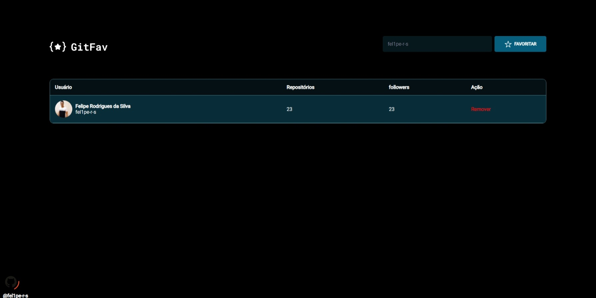

 # Github Fav

A ideia agora é desenvolver um aplicação para nos aprofundamos no conceito de class e de promises. A aplicação conseguimos busca um usuário do Github, adicionando aos favoritos.

## Layout da aplicação

Aqui neste **[link](<https://www.figma.com/file/SzQA07HwmSPj4hOYgu1Pps/%5BDesafios-Explorer%5D-GitFav/duplicate>)** você tem acesso ao Figma do projeto**.** Abaixo você pode ver como a aplicação deve ficar:

## Deploy

Para Acessa o projeto 

  
- Desafio proposto

